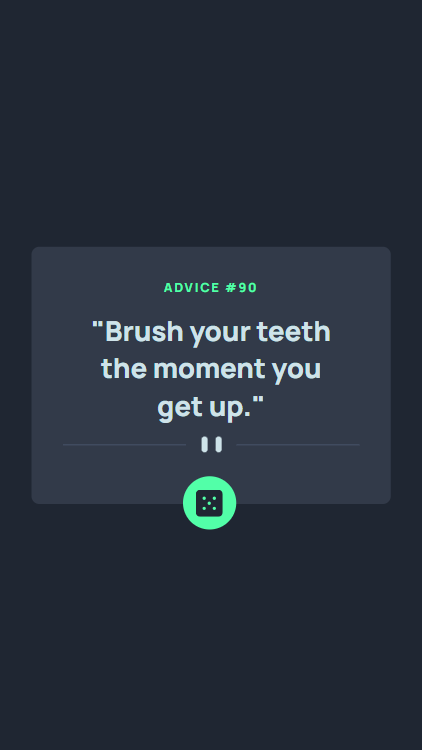
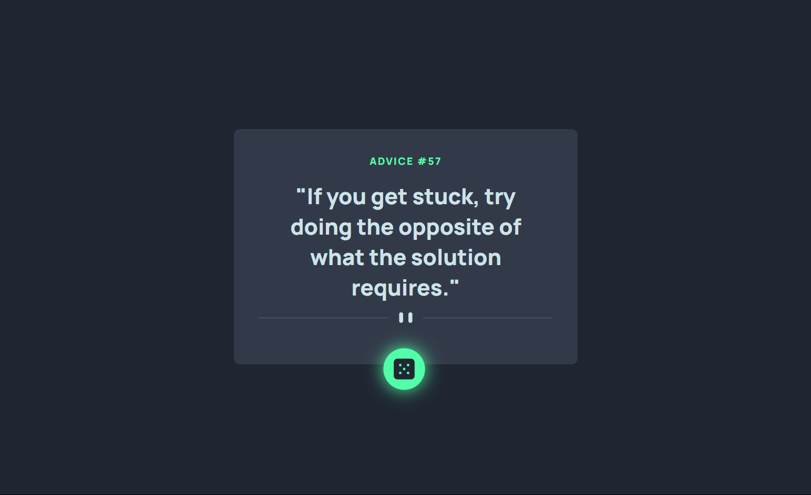

# Frontend Mentor - Advice generator app solution

This is a solution to the [Advice generator app challenge on Frontend Mentor](https://www.frontendmentor.io/challenges/advice-generator-app-QdUG-13db).

## Table of contents

- [Frontend Mentor - Advice generator app solution](#frontend-mentor---advice-generator-app-solution)
  - [Table of contents](#table-of-contents)
  - [Overview](#overview)
    - [The challenge](#the-challenge)
    - [Screenshot](#screenshot)
  - [Mobile Preview](#mobile-preview)
  - [Desktop Preview](#desktop-preview)
    - [Links](#links)
  - [My process](#my-process)
    - [Built with](#built-with)
    - [Useful resources](#useful-resources)
  - [Author](#author)

## Overview

### The challenge

Users should be able to:

- View the optimal layout for the app depending on their device's screen size
- See hover states for all interactive elements on the page
- Generate a new piece of advice by clicking the dice icon

### Screenshot

## Mobile Preview

## Desktop Preview

### Links

- Solution URL: [Click Here](https://www.frontendmentor.io/solutions/advice-generator-J16lDMtiMa)
- Live Site URL: [Click Here](https://karthikyerra1.github.io/advice-generator/)

## My process

### Built with

- CSS custom properties
- Flex box
- Mobile-first workflow
- [React](https://reactjs.org/) - JS library
- [Vite](https://vite.dev/) - Package Bundler

### Useful resources

- [API](https://api.adviceslip.com/advice) - This helped me to generate random Advice. I really liked this API and will use it going forward.

## Author

- Website - [Karthik Yerra]
- Frontend Mentor - [@KarthikYerra1](https://www.frontendmentor.io/profile/KarthikYerra1)
